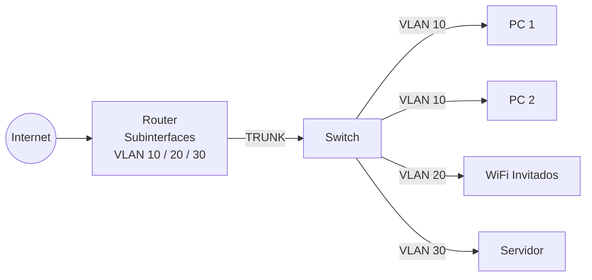
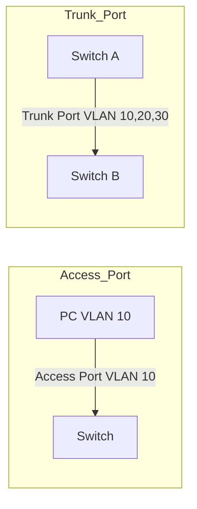

CiscoIOS --> Operative system of Cisco devices

- Support for IPv6
- Quality of Service (QoS)
- Security features such as encryption and authentication
- Virtualization features such as Virtual Private LAN Service (VPLS)
- Virtual Routing and Forwarding (VRF)

They can be controlled in several ways depending on the `device` but the most common method to manage them is through the CLI or GUI.

### Protocols that devices need

|**Protocol Type**|**Description**|
|---|---|
|`Routing protocols`|Such as [OSPF](https://en.wikipedia.org/wiki/Open_Shortest_Path_First) and [BGP](https://en.wikipedia.org/wiki/Border_Gateway_Protocol) are used to route data packets on a network.|
|`Switching protocols`|Such as [VLAN Trunking Protocol](https://en.wikipedia.org/wiki/VLAN_Trunking_Protocol) (`VTP`) and [Spanning Tree Protocol](https://en.wikipedia.org/wiki/Spanning_Tree_Protocol) (`STP`) is used to configure and manage switches on a network.|
|`Network services`|Such as [Dynamic Host Configuration Protocol](https://en.wikipedia.org/wiki/Dynamic_Host_Configuration_Protocol) (`DHCP`) are used to automatically provide clients on the network with IP addresses and other network configurations.|
|`Security features`|Such as [Access Control Lists](https://en.wikipedia.org/wiki/Access-control_list) (`ACLs`), which are used to control access to network resources and prevent security threats.|

### Types of passwords

|**Password Type**|**Description**|
|---|---|
|`User`|The [user](https://www.cisco.com/c/en/us/td/docs/ios-xml/ios/security/s1/sec-s1-cr-book/sec-cr-t2.html#wp2992613898) password is used for logging in to Cisco IOS. It is used to restrict access to the network device and its features.|
|`Enable Password`|The [enable password](https://www.cisco.com/c/en/us/td/docs/ios-xml/ios/security/d1/sec-d1-cr-book/sec-cr-e1.html#wp3884449514) is used to enter "enable" mode. The "enable" mode is the mode where you have access to advanced functions and settings.|
|`Secret`|The [secret](https://www.cisco.com/c/en/us/td/docs/ios-xml/ios/security/s1/sec-s1-cr-book/sec-cr-s1.html#wp2622423174) is a password to secure access to certain functions and services. It is often used to restrict access to remote management tools and services.|
|`Enable Secret`|The [enable secret](https://www.cisco.com/c/en/us/td/docs/ios-xml/ios/security/d1/sec-d1-cr-book/sec-cr-e1.html#wp3438133060) is an extra-secure password used to secure access to "enable" mode, and they are stored encrypted to provide additional protection.|

The devices can be accessed through `ssh` or `telnet` we can determine if its a Cisco device if it needs the `User Acces Verification`

```
shell-session
nilbabot@htb[/htb]$ telnet 10.129.10.2

Trying 10.129.10.2...
Connected to 10.129.10.2.
Escape character is '^]'.


User Access Verification

Password:
```


### VLAN

It consist in dividing a LAN and the end-points connected to a swith into other VLAN separated from the others splitting the ports from the swith doing subnets --> each VLAN will have a separated broadcast address.

ex: 

- Puertos 1–4 → VLAN 10 (oficina)
- Puertos 5–8 → VLAN 20 (invitados)

ex2:

|**Department**|**VLAN ID**|**Subnet**|
|:-:|:-:|:-:|
|`Servers`|`VLAN 10`|`192.168.1.0/24`|
|`C-Level`|`VLAN 20`|`192.168.2.0/24`|
|`Finance`|`VLAN 30`|`192.168.3.0/24`|
|`HR`|`VLAN 40`|`192.168.4.0/24`|
|`Marketing`|`VLAN 50`|`192.168.5.0/24`|
|`Support`|`VLAN 60`|`192.168.6.0/24`|

- `Better Organization`: Network administrators can group endpoints based on any common attribute they share.
- `Increased Security`: Network segmentation disallows unauthorized members from sniffing network packets in other `VLANs`.
- `Simplified Administration`: Network administrators do not have to worry about the physical locations of an endpoint.
- `Increased Performance`: With reduced broadcast traffic for all endpoints, more bandwidth is made available for use by the network.





CISCO switches provide `VLAN IDS` (0 and 4095 reserved)
- `1-1005` (`VLAN 1` is known as the default VLAN and cannot/should not be altered nor deleted)
	- `1002-1005` being reserved for `Token Ring` and `Fiber Distributed Data Interface` (`FDDI`) `VLANs`
- `1006-4094` are known as `extended-range` `VLANs`

The configurations from VLAN1 are saved in `vlan.dat` the extended ones doesn't have a configuration file.

### VLAN MEMBERSHIP

**STATIC** --> manually using the switch's `network operating system`
**DYNAMIC** --> automatically determines an endpoint's `VLAN` membership based on `MAC` addresses or protocols. System administrator register the `MAC` addresses in a centralized `VLAN` management service/database (`VLAN Membership Policy Server` (`VMPS`) service) and then the switch queries the database of `VMPS` to determine the `VLAN` of the endpoint with that specific `MAC` address.

Static is safer because ports are assigned to a determinate ID but in dynamic an attacker could switch his MAC ([macchanger](https://github.com/alobbs/macchanger) ) to spoof the MAC address of legitimate endpoints and attain membership of a device

### Acces and Trunk ports

```
Router
  |
  |  (TRUNK)
  |
Switch
 |      |
PC      WiFi
VLAN10  VLAN20
```

Puerto router → TRUNK

Puerto PC → ACCESS VLAN 10

Puerto WiFi → ACCESS VLAN 20




### VLAN Identification

`ISL` and `IEEE 802.1Q`.

### Inter-Switch Link (ISL)

ISL adds VLAN information so the switch knows **which VLAN a frame belongs to**. It does this by **encapsulating the entire Ethernet frame**, adding a **26-byte ISL header** (which contains the VLAN ID) and a **4-byte trailer**. The receiving switch reads the ISL header to identify the VLAN and process the traffic correctly.

### IEEE 802.1Q

![[Pasted image 20251222201150.png]]
- **TPID (Tag Protocol Identifier)**: 16-bit field, always `0x8100`, identifies the frame as 802.1Q-tagged
- **TCI (Tag Control Information)**: 16-bit field containing:
    - **PCP** (Priority Code Point)
    - **DEI** (Drop Eligible Indicator, formerly CFI)
    - **VID** (VLAN Identifier, lower 12 bits)
- **VID** allows `2^12 - 2 = 4094` usable VLAN IDs (0 and 4095 reserved)
- **802.1Q VLAN tagging**: inserting VLAN info into the Ethernet header
- **VLAN untagging**: removing VLAN info before forwarding to destination ports
- **Double Tagging (Q-in-Q, 802.1ad)**: inserting multiple 802.1Q tags in one frame

## VLAN-Capable NICs

Some `network interface cards` (`NICs`) attached to computers/servers support `VLAN tagging`. Let us see how we can assign a `VLAN` ID to a `NIC` using Linux and Windows.

**LINUX**:

To assign a network adapter a `VLAN` in Linux, many tools can be used, such as [ip](https://man7.org/linux/man-pages/man8/ip.8.html), [nmcli](https://linux.die.net/man/1/nmcli), and [vconfig](https://linux.die.net/man/8/vconfig) (deprecated). However, first, we need to ensure that the Kernel has the [802.1Q](https://elixir.bootlin.com/linux/v6.4.7/source/net/8021q/vlan.c) module loaded:

  VLANs

```shell-session
nilbabot@htb[/htb]$ sudo modprobe 8021q
```

Subsequently, we can use `lsmod` to make sure `8021q` was loaded successfully:

  VLANs

```shell-session
nilbabot@htb[/htb]$ lsmod | grep 8021

8021q                  40960  0
garp                   16384  1 8021q
mrp                    20480  1 8021q
```

Now, we need to find the name of the physical `Ethernet` interface that we will create the `VLAN` interface on top of, which is `eth0`:

  VLANs

```shell-session
nilbabot@htb[/htb]$ ip a

<SNIP>
2: eth0: <BROADCAST,MULTICAST,UP,LOWER_UP> mtu 1500 qdisc fq_codel state UP group default qlen 1000
    link/ether a6:ba:3b:08:3a:36 brd ff:ff:ff:ff:ff:ff
    altname enp0s3
    altname ens3
    inet 94.2X.5X.72/22 brd 94.237.51.255 scope global dynamic eth0
       valid_lft 83489sec preferred_lft 83489sec
    inet6 fe80::a4ba:3bff:fe08:3a36/64 scope link 
       valid_lft forever preferred_lft forever
```

Then, we will use `vconfig` to create a new interface that is a member of the desired `VLAN`, `20`, for example, on top of `eth0`:

  VLANs

```shell-session
nilbabot@htb[/htb]$ sudo vconfig add eth0 20

Warning: vconfig is deprecated and might be removed in the future, please migrate to ip(route2) as soon as possible!
```

To use `ip` instead:

  VLANs

```shell-session
sudo ip link add link eth0 name eth0.20 type vlan id 20
```

Either of these commands will make a new interface called `eth0.20@eth0`:

  VLANs

```shell-session
nilbabot@htb[/htb]$ ip a

<SNIP>
4: eth0.20@eth0: <BROADCAST,MULTICAST> mtu 1500 qdisc noop state DOWN group default qlen 1000
    link/ether a6:ba:3b:08:3a:36 brd ff:ff:ff:ff:ff:ff
```

Then, based on the `subnet` assigned to the addresses with `VLAN 20` within the local network, we need to assign the interface an IP address and then start it:

  VLANs

```shell-session
nilbabot@htb[/htb]$ sudo ip addr add 192.168.1.1/24 dev eth0.20
nilbabot@htb[/htb]$ sudo ip link set up eth0.20
```

At last, we can check whether the interface has changed states to up:

  VLANs

```shell-session
nilbabot@htb[/htb]$ ip a | grep eth0.20

4: eth0.20@eth0: <BROADCAST,MULTICAST,UP,LOWER_UP> mtu 1500 qdisc noqueue state UP group default qlen 1000
    inet 192.168.1.1/24 scope global eth0.20
```


- `eth0` → transporte físico
    
- `eth0.20` → “puerta lógica” a la VLAN 20
    
- Todo tráfico de la VLAN 20 **se envía y recibe a través de eth0.20**, pero físicamente viaja por `eth0`.
    
- Si tuvieras otra VLAN, por ejemplo `eth0.30`, también viajaría por `eth0` pero sería entregada a `eth0.30` gracias a la etiqueta VLAN.


### Analyzing VLAN Tagged Traffic

We can identify and analyze `VLAN` tagged traffic on a network with `Wireshark` using the [vlan](https://www.wireshark.org/docs/dfref/v/vlan.html) filter

![[Pasted image 20251222202033.png]]

### Security and VLAN attacks

