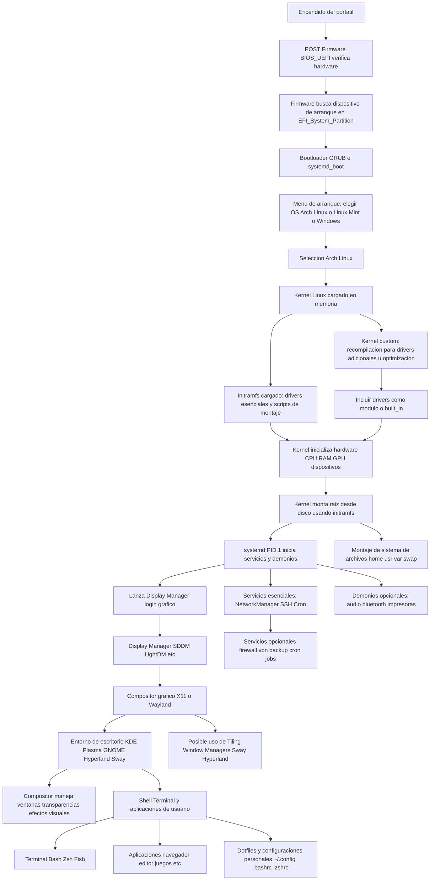

```mermaid
flowchart TD
    %% 1️⃣ Encendido y Firmware
    A[Encendido del portatil] --> B[POST Firmware BIOS_UEFI verifica hardware]
    B --> C[Firmware busca dispositivo de arranque en EFI_System_Partition]
    
    %% 2️⃣ Bootloader
    C --> D[Bootloader GRUB o systemd_boot]
    D --> D1[Menu de arranque: elegir OS Arch Linux o Linux Mint o Windows]
    D1 --> D2[Seleccion Arch Linux]
    
    %% 3️⃣ Kernel e initramfs
    D2 --> E[Kernel Linux cargado en memoria]
    E --> E1[Initramfs cargado: drivers esenciales y scripts de montaje]
    E1 --> E2[Kernel inicializa hardware CPU RAM GPU dispositivos]
    E2 --> E3[Kernel monta raiz desde disco usando initramfs]
    
    %% 4️⃣ systemd y servicios
    E3 --> F[systemd PID 1 inicia servicios y demonios]
    F --> F1[Servicios esenciales: NetworkManager SSH Cron]
    F --> F2[Lanza Display Manager login grafico]
    F --> F3[Demonios opcionales: audio bluetooth impresoras]
    
    %% 5️⃣ Sistema de archivos
    E3 --> G[Montaje de sistema de archivos home usr var swap]
    
    %% 6️⃣ Entorno gráfico
    F2 --> H[Display Manager SDDM LightDM etc]
    H --> I[Compositor grafico X11 o Wayland]
    I --> I1[Entorno de escritorio KDE Plasma GNOME Hyperland Sway]
    I1 --> I2[Compositor maneja ventanas transparencias efectos visuales]
    
    %% 7️⃣ Shell y aplicaciones
    I1 --> J[Shell Terminal y aplicaciones de usuario]
    J --> J1[Terminal Bash Zsh Fish]
    J --> J2[Aplicaciones navegador editor juegos etc]
    
    %% 8️⃣ Configuracion del usuario
    J --> K[Dotfiles y configuraciones personales ~/.config .bashrc .zshrc]
    
    %% 9️⃣ Kernel avanzado y recompilacion
    E --> L[Kernel custom: recompilacion para drivers adicionales u optimizacion]
    L --> L1[Incluir drivers como modulo o built_in]
    L1 --> E2
    
    %% 10️⃣ Notas adicionales
    F1 --> M[Servicios opcionales firewall vpn backup cron jobs]
    I --> N[Posible uso de Tiling Window Managers Sway Hyperland]

```
